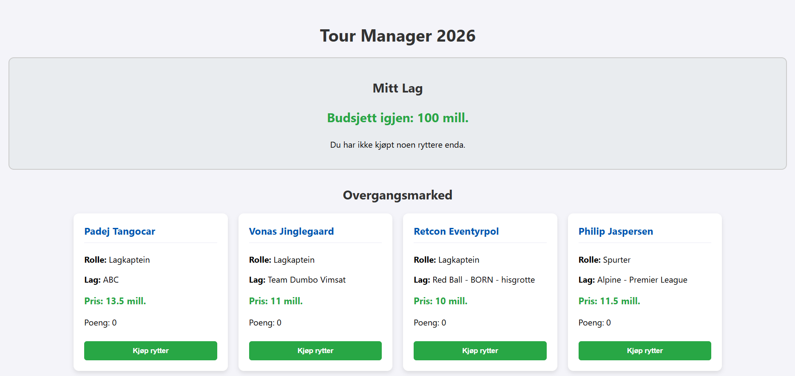

TourManager 🚴

A fantasy manager game for the Tour de France, built with Java and Spring Boot. Assemble your dream team of riders within a limited budget, balance your squad across rider roles, and compete for points as the race unfolds.

* Note: The domain code and UI are in Norwegian, as the game is built for Norwegian users. Commit messages and documentation are in English.

Features

* Budget system – build your team with a fixed budget of 100M; every purchase and sale updates your remaining funds
* Role quotas – squads must be balanced across roles (team captain, sprinter, climber, domestique, etc.), each with its own limit
* Team cap – a maximum of 3 riders from the same pro team, so you can't just buy the whole peloton's strongest squad
* Captain bonus – your team captain earns double points
* Transfer market UI – browse all riders as cards and buy them straight from the browser

Tech stack

LayerTechnologyBackendJava 22, Spring Boot 3.2 (REST API)DataJSON rider dataset, loaded at startup (database planned – see roadmap)FrontendVanilla HTML/CSS/JavaScript, served as static content by Spring BootBuildMaven

The backend follows a layered architecture: controllers handle HTTP concerns only, while rider lookup and game logic live in service and domain classes, wired together with Spring's constructor-based dependency injection.

Getting started

Prerequisites: JDK 22 (or adjust maven.compiler.source/target in pom.xml) and Maven.

bashgit clone https://github.com/thomasdberge/TourManager.git
cd TourManager
mvn spring-boot:run

Then open http://localhost:8080 in your browser.

API overview

MethodEndpointDescriptionGET/api/ryttereList all available ridersGET/api/lagGet your team: budget and selected ridersPOST/api/lag/kjop?id={id}Buy a rider. Returns 200 on success, 400 if rejected (budget/quota), 404 if the rider doesn't exist

Example:

bashcurl -X POST "http://localhost:8080/api/lag/kjop?id=1"

Roadmap

Sell riders from the UI (DELETE endpoint)
Persist teams in a database (Spring Data JPA + PostgreSQL)
Multiple users and a league leaderboard
Stage results and live point scoring during the Tour
Unit tests for the game rules + CI with GitHub Actions
Android app (Kotlin + Jetpack Compose) using the same API

About

Built as a personal project by a computer science student at OsloMet, combining an interest in pro cycling with backend development. Feedback and suggestions are welcome!